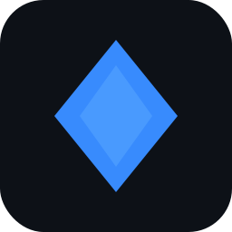

# NexCode IDE

<div id="NexCode-logo" align="center">
    <br />
    
    <h1>NexCode</h1>
    <h3>Free/Libre Open Source Software</h3>
</div>

<div id="badges" align="center">

[](LICENSE)
[](https://github.com/Hyggshi-OS-project-center/NexCode/releases)
[](https://github.com/Hyggshi-OS-project-center/NexCode/releases)
[](https://github.com/Hyggshi-OS-project-center/NexCode/releases)
[](https://www.electronjs.org/)
[](https://www.typescriptlang.org/)
[](https://github.com/Hyggshi-OS-project-center/NexCode/releases) 

</div>


## The Repository

This repository is where we develop **NexCode IDE** — a lightweight, extensible code editor built on [Electron](https://www.electronjs.org/), [TypeScript](https://www.typescriptlang.org/), [Vite](https://vitejs.dev/), and [Monaco Editor](https://microsoft.github.io/monaco-editor/). NexCode is part of the [Hyggshi OS](https://github.com/Hyggshi-OS-project-center) ecosystem, designed to provide a fast and modern development experience.

The source code is available under the [MIT license](LICENSE).

## NexCode IDE

NexCode IDE combines a clean, minimal editor interface with powerful developer tooling — including syntax highlighting, IntelliSense-style completions, multi-tab editing, and first-class support for the **HOSC/HOSC++** programming language used across Hyggshi OS projects.

NexCode is designed to be fast, hackable, and deeply integrated with the Hyggshi OS development workflow.

## Features

- 🖥️ **Cross-platform** — runs on Windows, macOS, and Linux via Electron
- ⚡ **Fast startup** — powered by Vite for near-instant dev builds
- 🎨 **Monaco Editor core** — the same editor engine behind VS Code
- 🧠 **HOSC/HOSC++ support** — syntax highlighting and language tooling for Hyggshi OS's custom language
- 🗂️ **Multi-tab editing** — manage multiple files simultaneously
- 🌙 **Dark mode first** — built with a dark, developer-friendly UI
- 🔌 **Extensible** — modular architecture for adding new language support and features

## Contributing

There are many ways to get involved:

- [Submit bugs and feature requests](https://github.com/Hyggshi-OS-project-center/NexCode/issues)
- Review [source code changes](https://github.com/Hyggshi-OS-project-center/NexCode/pulls)
- Improve documentation or add examples

If you want to contribute directly to the codebase, please check the [How to Contribute](https://github.com/Hyggshi-OS-project-center/NexCode/wiki/How-to-Contribute) guide, which covers:

- How to build and run from source
- Project structure and architecture
- Coding guidelines
- Submitting pull requests

## Building from Source

```bash
# Clone the repository
git clone https://github.com/Hyggshi-OS-project-center/NexCode.git
cd NexCode

# Install dependencies
npm install

# Run in development mode
npm run dev

# Build for production
npm run build
```

## Tech Stack

| Layer | Technology |
|---|---|
| Shell | Electron |
| Language | TypeScript |
| Bundler | Vite |
| Editor core | Monaco Editor |
| UI | HTML / CSS |

## Related Projects

NexCode is part of the broader **Hyggshi OS** ecosystem:

- [Hyggshi OS](https://github.com/Hyggshi-OS-project-center) — the main Roblox OS simulator
- [HOSC/HOSC++](https://github.com/Hyggshi-OS-project-center/HOSC-Language) — Hyggshi OS's custom programming language and VM
- [Hyggshi OS Web Edition](https://hyggshi-os-website.pages.dev/OSmain) — PWA version on Cloudflare Pages

## Feedback

- [File an issue](https://github.com/Hyggshi-OS-project-center/NexCode/issues)
- [Request a new feature](https://github.com/Hyggshi-OS-project-center/NexCode/issues/new)
- [Join the Hyggshi OS Discord community](https://discord.gg/PZuDkFzJtc)

## License

Copyright (c) Hyggshi OS Project Center. All rights reserved.

Licensed under the [MIT](LICENSE) license.
